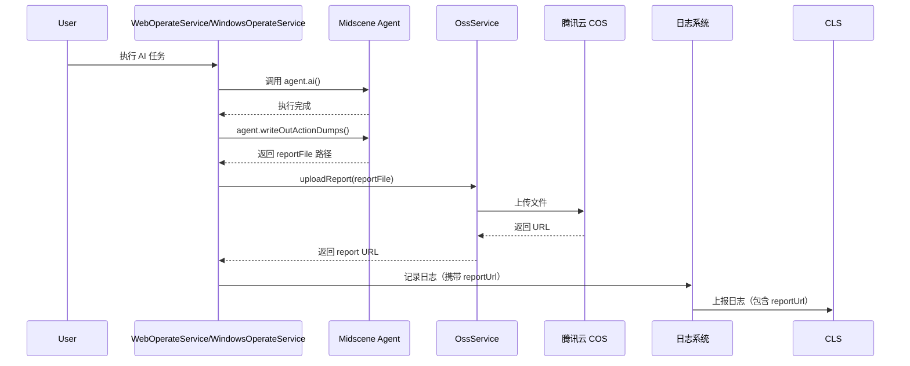

# Midscene Report OSS 上传功能

## 功能概述

每次 midscene 执行完成后，自动将生成的 HTML report 上传到腾讯云 COS，并在日志上报时携带最新的 report URL，方便快速查看执行报告。

## 功能特性

- ✅ 自动上传 report 到腾讯云 COS
- ✅ 支持 Web 和 Windows 平台
- ✅ 日志系统自动携带最新 report URL
- ✅ 上传失败不影响主流程
- ✅ 可选配置，未配置时不影响现有功能

## 配置说明

### 环境变量配置

在 `.env` 文件中添加以下配置：

```env
# 腾讯云 COS 配置（必填）
COS_SECRET_ID=your_secret_id              # 腾讯云 SecretId
COS_SECRET_KEY=your_secret_key            # 腾讯云 SecretKey
COS_BUCKET=your-bucket-name               # COS 存储桶名称
COS_REGION=ap-guangzhou                   # COS 地域，如：ap-guangzhou, ap-beijing

# 可选配置
COS_REPORT_PATH=midscene-reports          # 报告存储路径，默认：midscene-reports
```

### 获取腾讯云 COS 配置

1. **登录腾讯云控制台**
   - 访问：https://console.cloud.tencent.com/

2. **创建存储桶**
   - 进入「对象存储 COS」控制台
   - 创建新的存储桶
   - 记录存储桶名称和地域

3. **获取密钥信息**
   - 访问「访问管理」->「访问密钥」->「API 密钥管理」
   - 创建或查看 SecretId 和 SecretKey

4. **配置存储桶权限**（可选）
   - 如果需要公开访问报告，配置存储桶为公有读私有写
   - 或配置特定的访问策略

## 使用示例

### 开发环境配置

```env
# .env.development
COS_SECRET_ID=AKIDxxxxxxxxxxxxx
COS_SECRET_KEY=xxxxxxxxxxxxxxxx
COS_BUCKET=midscene-dev
COS_REGION=ap-guangzhou
COS_REPORT_PATH=reports/dev
```

### 生产环境配置

```env
# .env.production
COS_SECRET_ID=AKIDxxxxxxxxxxxxx
COS_SECRET_KEY=xxxxxxxxxxxxxxxx
COS_BUCKET=midscene-prod
COS_REGION=ap-guangzhou
COS_REPORT_PATH=reports/prod
```

## 工作流程



## 日志示例

上传成功后，日志系统会自动携带 `reportUrl` 字段：

```json
{
  "level": "info",
  "message": "AI 任务执行完成",
  "module": "service",
  "reportUrl": "https://your-bucket.cos.ap-guangzhou.myqcloud.com/midscene-reports/windows-2025-10-21_11-04-38-5903e2ab.html",
  "timestamp": 1729486478000
}
```

## API 接口

### OssService

```typescript
import { ossService } from './services/ossService';

// 检查服务是否可用
const isReady = ossService.isReady();

// 上传单个文件
const url = await ossService.uploadReport('/path/to/report.html');

// 获取最新上传的 report URL
const latestUrl = ossService.getLatestReportUrl();

// 批量上传
const urls = await ossService.uploadReports([
  '/path/to/report1.html',
  '/path/to/report2.html',
]);

// 获取服务状态
const status = ossService.getStatus();
```

## 注意事项

1. **配置检查**
   - 启动时会检查 COS 配置是否完整
   - 配置不完整时会自动禁用上传功能
   - 不影响现有的 midscene 执行流程

2. **上传失败处理**
   - 上传失败只记录日志，不会中断主流程
   - 保证服务的稳定性和可用性

3. **性能影响**
   - 上传操作是异步的，不阻塞主流程
   - 建议在生产环境配置足够的网络带宽

4. **成本控制**
   - 注意 COS 的存储和流量费用
   - 可以配置生命周期规则自动删除旧报告

## 故障排查

### 问题：上传失败

**检查步骤：**
1. 确认环境变量配置是否正确
2. 检查 COS 密钥是否有效
3. 确认存储桶名称和地域是否正确
4. 查看服务器日志获取详细错误信息

### 问题：日志中没有 reportUrl

**可能原因：**
1. COS 配置未启用
2. report 文件生成失败
3. 上传失败
4. 该次执行未生成 report

## 相关文档

- [腾讯云 COS 产品文档](https://cloud.tencent.com/document/product/436)
- [COS Node.js SDK](https://cloud.tencent.com/document/product/436/8629)
- [Midscene 官方文档](https://midscenejs.com/)

## 更新日志

### v1.0.0 (2025-10-21)
- ✨ 新增 Report 自动上传到 COS 功能
- ✨ 日志系统集成最新 reportUrl
- ✨ 支持 Web 和 Windows 平台
- ✨ 完整的错误处理和日志记录

